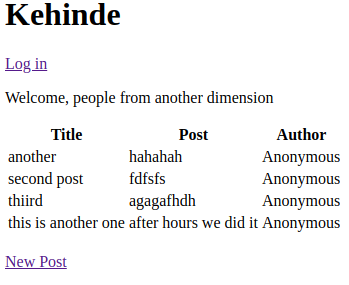
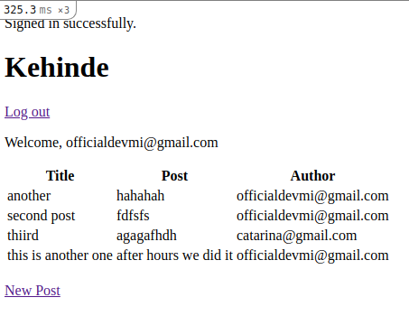

# Rails Project: Authentication

This project is built on the fundamentals of creating authentication and validation of a user.

## When a user is signed out:



## When a user is signed in:



## Built-With

- Ruby -v  2.7.2
- Rails -v 6.0
- SQLite3
- VScode

### Prerequisites

To get this project up and running locally, you must already have ruby and necessary gems installed on your computer

**To get this project set up on your local machine, follow these simple steps:**

1. Open Terminal.
2. Navigate to your desired location to download the contents of this repository.
3. Copy and paste the following code into the Terminal: git clone ```git@github.com:Leandro-Barretoo/mem_only.git```
4. cd```mem_only```.
5. Run ```bundle install``` to get the necesary gems.
6. Run `rails db:migrate`.
7. Run `rails server` and visit `http://localhost:3000/ ` to create start the example.


## Authors

👤 **Leandro Barreto**

- Github: [@Leandro-Barretoo](https://github.com/Leandro-Barretoo)

👤 **Oluwadare Juwon**

- Github: [@wintan1418](https://github.com/wintan1418)

## Acknowledgment

The resources we have used to develop our project:

- [Odin-project](https://www.theodinproject.com/courses/ruby-on-rails/lessons/forms)

## Show your support

Give ⭐ Star me on GitHub — it helps!

## 📝 License

Copyright 2020 Leandro Barreto & Juwon Joshua

Permission is hereby granted, free of charge, to any person obtaining a copy of this software and associated documentation files (the "Software"), to deal in the Software without restriction, including without limitation the rights to use, copy, modify, merge, publish, distribute, sublicense, and/or sell copies of the Software, and to permit persons to whom the Software is furnished to do so, subject to the following conditions:

The above copyright notice and this permission notice shall be included in all copies or substantial portions of the Software.

THE SOFTWARE IS PROVIDED "AS IS", WITHOUT WARRANTY OF ANY KIND, EXPRESS OR IMPLIED, INCLUDING BUT NOT LIMITED TO THE WARRANTIES OF MERCHANTABILITY, FITNESS FOR A PARTICULAR PURPOSE AND NONINFRINGEMENT. IN NO EVENT SHALL THE AUTHORS OR COPYRIGHT HOLDERS BE LIABLE FOR ANY CLAIM, DAMAGES OR OTHER LIABILITY, WHETHER IN AN ACTION OF CONTRACT, TORT OR OTHERWISE, ARISING FROM, OUT OF OR IN CONNECTION WITH THE SOFTWARE OR THE USE OR OTHER DEALINGS IN THE SOFTWARE. 
